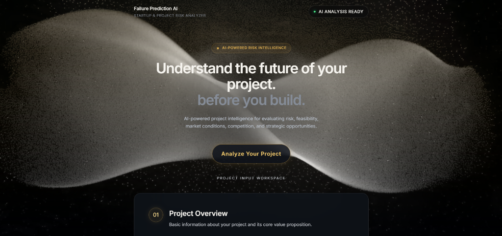
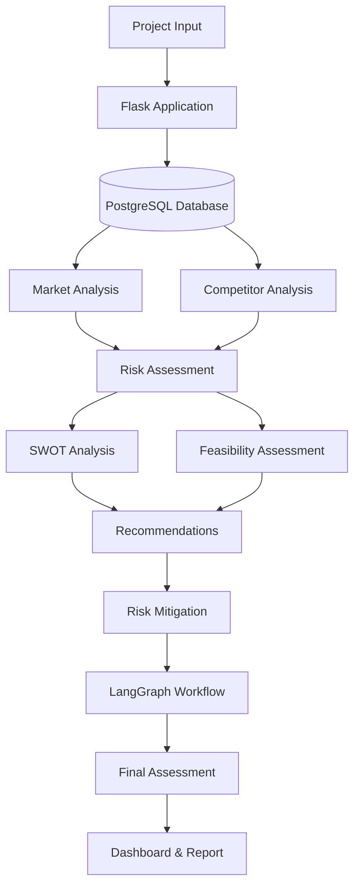

# Failure Prediction AI – Startup & Project Risk Analyzer

> **Infosys Springboard Virtual Internship Project**



## Overview

Failure Prediction AI is an AI-assisted project intelligence platform designed to evaluate startups and projects across multiple critical dimensions before significant resources are invested. By leveraging deterministic analysis combined with AI reasoning, the system evaluates market conditions, competitive landscapes, project risks, feasibility, and SWOT factors to produce actionable strategic recommendations and risk mitigation strategies. 

The application takes structured business inputs from the user and passes them through a sophisticated reasoning workflow, culminating in a consolidated project assessment dashboard and a downloadable report.

Developed as part of the Infosys Springboard Virtual Internship, this project demonstrates the integration of deterministic backend calculation engines with AI/LLM agent workflows to solve complex operational and strategic business problems.

## Problem Statement

Startup and project ideas often fail due to systemic factors such as:
- Fierce market competition
- Insufficient resources or capital
- Limited domain expertise
- Weak or unstructured market research
- Low practical feasibility
- Operational constraints
- Strategic gaps

Without a structured, data-driven way to assess these risk factors early on, organizations can waste significant time and capital. Failure Prediction AI provides structured, objective decision-support to analyze these vulnerabilities *before* irreversible investments are made.

## Objectives

The primary objectives of this system are to:
- Collect structured project information (budget, market, competition, etc.).
- Analyze market and competitor conditions systematically.
- Calculate objective project risk scores based on defined heuristics.
- Estimate success probabilities based on the calculated risk.
- Generate structured SWOT (Strengths, Weaknesses, Opportunities, Threats) analyses.
- Evaluate the practical feasibility of the project.
- Generate context-aware strategic recommendations.
- Generate targeted risk mitigation strategies.
- Run a structured LangGraph reasoning workflow to process and validate intelligence.
- Produce a unified, interactive final project intelligence report.
- Provide a downloadable artifact of the assessment.

## Key Features

### Project Information Collection
The system features a premium, interactive user interface to collect crucial project data, including:
- Project Name & Description
- Target Market
- Budget
- Competition
- Resources & Team Capabilities
- Primary Objectives

### Market & Competitor Intelligence
The system analyzes the structured inputs to assess the target market and the competitive landscape. Using rule-based heuristics and deterministic analysis, it evaluates the intensity of the competition and the viability of the market opportunity based on the provided parameters.

### Risk Assessment
The core risk engine calculates a comprehensive risk score (0-100) using defined project factors, including:
- Market Competition
- Team Expertise
- Resource Availability
- Innovation Level
- Market Research

Based on the implemented project risk inputs and scoring rules, the risk is categorized as:
- **0–39:** LOW RISK
- **40–69:** MEDIUM RISK
- **70–100:** HIGH RISK

The system also calculates the **Success Probability** using the formula:
`Success Probability = 100 - Risk Score`

### SWOT Analysis
The system automatically maps project characteristics to generate a comprehensive SWOT matrix:
- **Strengths:** Internal advantages (e.g., strong team, high budget).
- **Weaknesses:** Internal disadvantages (e.g., lack of resources).
- **Opportunities:** External chances for growth (e.g., low competition, high innovation).
- **Threats:** External risks (e.g., saturated market).

### Feasibility Assessment
Feasibility is evaluated across four distinct dimensions:
- Market Opportunity
- Team Capability
- Competitive Advantage
- Resource Availability

The final feasibility score is the arithmetic mean of these four values.

### AI Recommendations
Based on the project's unique conditions and the calculated risk profile, the system generates targeted strategic recommendations to improve the project's chances of success.

### Risk Mitigation
The mitigation engine maps specific identified risk conditions (e.g., high competition combined with low budget) to concrete, actionable mitigation strategies to proactively protect the project.

### LangGraph AI Reasoning Workflow
The intelligence pipeline is orchestrated using a structured reasoning workflow consisting of five stages:
1. Data Ingestion
2. Risk Analysis
3. Strategic Reasoning
4. Validation
5. Report Generation

### Final Assessment / Report
The output of the workflow is a beautifully rendered, interactive dashboard containing:
- Consolidated assessment metrics
- Risk score & success probability
- Feasibility breakdown
- Market & competitor analysis
- SWOT matrix
- Strategic recommendations
- Mitigation strategies
- The documented reasoning workflow

Users can also export this data as a downloadable final report.

## Technology Stack

| Layer | Technology |
|---|---|
| Language | Python |
| Web Framework | Flask |
| Database | PostgreSQL |
| AI/LLM | Google Gemini |
| Agent Workflow | LangGraph |
| Data/Analysis | Python-based deterministic analysis |
| Frontend | HTML, CSS, JavaScript (Vanilla) |
| Testing | Python test suite |
| Deployment | WSGI-compatible deployment |

## System Architecture



## Project Structure

```text
Failure-Prediction-AI-Startup-Project-Risk-Analyzer/
│
├── assets/
│   └── project-dashboard.png
│
├── static/
│   └── style.css
│
├── templates/
│   ├── index.html
│   └── result.html
│
├── app.py
├── database.py
├── market_analysis.py
├── competitor_analysis.py
├── risk_engine.py
├── swot_analysis.py
├── feasibility.py
├── recommendation_engine.py
├── mitigation_engine.py
├── llm_service.py
├── langgraph_agent.py
├── report_generator.py
├── wsgi.py
│
├── run_tests.py
├── test_submit.py
│
├── requirements.txt
├── .env.example
├── .gitignore
└── README.md
```

## Installation / Setup

1. **Clone repository:**
   ```bash
   git clone https://github.com/kharshith-cloud/Failure-Prediction-AI-Startup-Project-Risk-Analyzer.git
   cd Failure-Prediction-AI-Startup-Project-Risk-Analyzer
   ```

2. **Create virtual environment:**
   ```bash
   python -m venv venv
   source venv/bin/activate  # On Windows: venv\Scripts\activate
   ```

3. **Install requirements:**
   ```bash
   pip install -r requirements.txt
   ```

4. **Configure .env:**
   Copy `.env.example` to `.env` and configure your credentials.
   ```bash
   cp .env.example .env
   ```
   Ensure `.env` contains:
   ```env
   DB_HOST=localhost
   DB_PORT=5432
   DB_NAME=failure_prediction_db
   DB_USER=your_user
   DB_PASSWORD=your_password
   GEMINI_API_KEY=your_gemini_api_key
   ```

5. **Create/configure PostgreSQL database:**
   Create a PostgreSQL database named `failure_prediction_db` and ensure the credentials match your `.env` file. The application will automatically create the required tables upon initialization.

## Running the Application

Start the Flask server:
```bash
python app.py
```
Access the application at `http://localhost:5000`.

## Testing

Run the automated test suite to verify deterministic logic, AI integration, and workflow orchestration:
```bash
python run_tests.py
```

## Development Milestones

### Milestone 1 – Foundation & Market Intelligence
- Project input collection
- PostgreSQL persistence
- Market analysis
- Competitor analysis

### Milestone 2 – Risk & Feasibility Intelligence
- Risk scoring
- Success probability
- SWOT analysis
- Feasibility assessment

### Milestone 3 – AI & Strategic Intelligence
- Recommendations
- Risk mitigation
- Gemini integration
- LangGraph workflow
- Deterministic fallback

### Milestone 4 – Dashboard & Final Reporting
- Professional dashboard
- Final assessment
- Report generation/download
- Validation
- Error handling
- Performance measurement
- Deployment readiness
- Testing

## Future Enhancements
- Integration of real-time market data APIs.
- User authentication and role-based access control.
- Historical trend analysis and machine learning based risk predictions.
- Export to PDF and advanced customizable reports.
